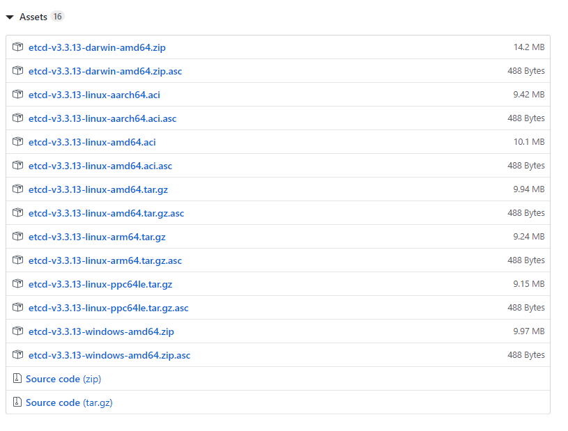
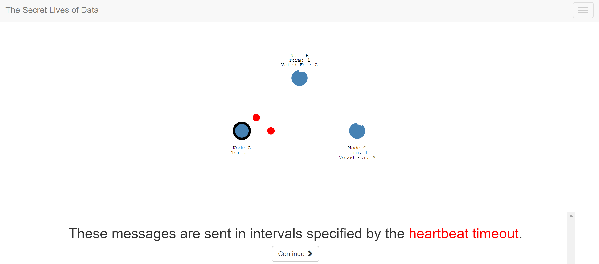

# 简介

[etcd](https://github.com/etcd-io/etcd)是一个可靠的分布式key-value存储服务，常用于存储分布式系统的关键数据，它具有以下特点：

- **简洁**：定义明确，面向用户的API（最新版基于[gRPC](https://github.com/grpc/grpc)）
- **安全**：客户端可选自带的[TLS](https://en.wikipedia.org/wiki/Transport_Layer_Security)证书鉴权
- **快速**：基准测试下可达10,000次写/秒
- **可靠**：分布式下使用[Raft](https://raft.github.io/)一致性协议确保可靠

etcd是用Go编写的，在Raft下通过复制日志确保一致性。

Etcd 构建自身高可用集群主要有三种形式:

* 静态发现: 预先已知 Etcd 集群中有哪些节点，在启动时直接指定好 Etcd 的各个 node 节点地址.
* Etcd 动态发现: 通过已有的 Etcd 集群作为数据交互点，然后在扩展新的集群时实现通过已有集群进行服务发现的机制.
* DNS 动态发现: 通过 DNS 查询方式获取其他节点地址信息.

etcd被[许多公司](https://github.com/etcd-io/etcd/blob/master/Documentation/production-users.md)用于[生产环境](https://github.com/etcd-io/etcd/blob/master/Documentation/production-users.md)，并部署在关键场景中，它经常与[Kubernetes](http://kubernetes.io/)，[locksmith](https://github.com/coreos/locksmith)，[vulcand](https://github.com/vulcand/vulcand)，[Doorman](https://github.com/youtube/doorman)等服务配合使用。它通过[**测试**](https://github.com/etcd-io/etcd/tree/master/functional)确保可靠性。

更详细介绍请参照[官方文档](https://etcd.readthedocs.io/en/latest)

# 安装与运行

在[releases页面](https://github.com/etcd-io/etcd/releases)可以获取etcd预构建版本二进制文件,它包含了OSX，Linux，Windows和Docker的版本。



## Windows

1. 下载[releases页面](https://github.com/etcd-io/etcd/releases)中名为`etcd-*-windows-amd64.zip`文件
2. 解压后直接运行`etcd.exe`就可以零配置开启一个etcd-server,默认监听`127.1:2379`.
3. 如果想要在命令行中练习,需要在当前目录下打开命令行工具,通过`./etcdctl.exe h`查看帮助或执行合适的命令.
4. 在命令行设置`export ETCDCTL_API=3`   (PowerShell下为`$Env:ETCDCTL_API=3`)  可以使etcdctl使用v3版本的API
5. 为了方便起见,可以将`etcdctl.exe`所在的目录添加到PATH下,这样就可以使用`etcdctl xxx`执行命令了

## Linux

TODO:

## Docker

TODO:

## OSX

TODO:

## 集群搭建

搭建etcd集群有多种方式,这里介绍最常见的**静态发现**方式,除此之外还有**etcd动态发现**和**DNS动态发现**的集群搭建方式.etcd不仅可以单独部署,同时也可以**内嵌**入任意服务中捆绑部署.

### 环境

在Ubuntu 18.04下搭建,集群内共3个节点,节点信息如下:

| 节点名称 | 地址         |
| -------- | ------------ |
| etcd0    | 192.168.1.10 |
| etcd1    | 192.168.1.11 |
| etcd2    | 192.168.1.12 |

### 安装

在[releases](https://github.com/etcd-io/etcd/releases)页面中下载与操作系统相应的二进制程序包或直接从源码编译,本示例使用[etcd-v3.3.13-linux-amd64.tar.gz](https://github.com/etcd-io/etcd/releases/download/v3.3.13/etcd-v3.3.13-linux-amd64.tar.gz)二进制程序包演示安装过程.

1. 在三台机器上分别解压文件,并将**etcd**与**etcdctl**拷贝到`/usr/local/bin`下

   ```shell
   $ tar -zxvf etcd-v*-linux-*.tar.gz
   $ cd etcd-v*-linux-*
   $ cp etcd etcdctl /usr/local/bin/
   ```

2. 创建数据文件目录

   ```shell
   $ mkdir -p /var/lib/etcd
   ```

### 配置文件

编辑配置文件,以**etcd0**节点为例,**etcd1**与**etcd2**的配置文件以此类推. 

除使用配置文件启动,etcd还提供了**环境变量**与**命令行参数**的启动方式,三者功能等效,但优先级有差别

```shell
$ mkdir -p /etc/etcd
$ vi /etc/etcd/conf.yml
```

```yaml
#conf.yml

#节点名称,确保唯一即可
name: etcd0
#数据文件存放目录
data-dir: /var/lib/etcd
#心跳间隔时间(ms),如无必要可不设置
heartbeat-interval: 100
#选举超时时间(ms),如无必要可不设置
election-timeout: 1000
#监听对等端请求的地址,格式为scheme://IP:port,逗号分隔,不能使用域名
listen-peer-urls: http://192.168.1.10:2380
#监听客户端请求的地址,格式为scheme://IP:port,逗号分隔,不能使用域名
listen-client-urls: http://192.168.1.10:2379

##集群相关配置
#列举出集群成员,格式 name=scheme://IP:port,... 这里的地址应与各节点initial-advertise-peer-urls配置相同
initial-cluster: etcd0=http://192.168.1.10:2380,etcd1=http://192.168.1.11:2380,etcd2=http://192.168.1.12:2380
#列出本节点的listen-peer-urls,这将广播给集群内其他成员
initial-advertise-peer-urls: http://192.168.1.10:2380
#列出本节点的listen-client-urls,这将广播给集群内其他成员
advertise-client-urls: http://192.168.1.10:2379
#集群状态标记,"new" or "existing",new表示正在新建集群,existing表示该节点尝试加入已有集群
initial-cluster-state: new
#集群token,本集群内配置同一个token,不同集群间配置不同token,token+name确定唯一节点
initial-cluster-token: etcd-cluster-token

##TSL相关(可选),此处假设证书已经生成,证书存放路径为/etc/ssl/etcd/...
cert-file: /etc/ssl/etcd/server.pem
key-file: /etc/ssl/etcd/server-key.pem
trusted-ca-file: /etc/ssl/etcd/ca.pem
client-cert-auth: true
peer-cert-file: /etc/ssl/etcd/server.pem
peer-key-file: /etc/ssl/etcd/server-key.pem
peer-trusted-ca-file: /etc/ssl/etcd/ca.pem
peer-client-cert-auth: true
```

### 尝试启动

在三台机器上分别启动etcd节点,并检查集群状态

```shell
#启动etcd节点,实际使用中应配置systemd unit文件并添加开机自启动
$ etcd --config-file=/etc/etcd/conf.yml

#检查集群状态
##v2 api
$ export ETCDCTL_API=2
$ etcdctl cluster-health
member 2618ce5cd761aa8 is healthy: got healthy result from http://192.168.1.10:2379
member 9c359d48a2f3493 is healthy: got healthy result from http://192.168.1.11:2379
member f3c45714407d68f is healthy: got healthy result from http://192.168.1.12:2379
cluster is healthy

##v3 api
$ export ETCDCTL_API=3
$ etcdctl --write-out=table --endpoints=192.168.1.10:2379 member list
+---------------+-------+-----+--------------------------+--------------------------+
|       ID      |STATUS |NAME |       PEER ADDRS         |      CLIENT ADDRS        |
+---------------+-------+-----+--------------------------+--------------------------+
|2618ce5cd761aa8|started|etcd0| http://192.168.1.10:2380 | http://192.168.1.10:2379 | 
|9c359d48a2f3493|started|etcd1| http://192.168.1.11:2380 | http://192.168.1.11:2379 |
|f3c45714407d68f|started|etcd2| http://192.168.1.12:2380 | http://192.168.1.12:2379 |
+---------------+-------+-----+--------------------------+--------------------------+
```

### 配置自启动脚本

```shell
$ vi /usr/lib/systemd/system/etcd.service
```

```shell
[Unit]
Description=etcd server
After=network.target
After=network-online.target
Wants=network-online.target

[Service]
Type=notify
WorkingDirectory=/var/lib/etcd
ExecStart=/usr/local/bin/etcd --config-file=/etc/etcd/conf.yml
NotifyAccess=all
Restart=always
RestartSec=5s
LimitNOFILE=65536

[Install]
WantedBy=multi-user.target
```

尝试使用`systemctl`启动服务

```shell
$ systemctl daemon-reload
$ systemctl enable etcd
$ systemctl start etcd
$ systemctl status etcd
● etcd.service - etcd server
   Loaded: loaded (/usr/lib/systemd/system/etcd.service; enabled; vendor preset: enabled)
   Active: activating (start) since Mon 2019-08-12 12:30:00 CST; 33s ago
   ......
```


# 交互命令

> $ etcdctl version
> etcdctl version: 3.3.13
> API version: 3.3

## Put

*注: 该命令在**API version: 2**版本中是`set`*

应用通过`put`来储存kv到 etcd 中。etcd集群间通过 Raft 协议复制到所有成员来实现一致性和可靠性。

设置键 `foo` 的值为 `bar` 

``` bash
$ etcdctl put foo bar
OK
```

而且可以通过附加租约的方式为key设置过期时间。

将键 foo1 的值设置为 bar1 并在10s后过期的命令：

```bash
# 授予租约，TTL为10秒
$ etcdctl lease grant 10
lease 32695410dcc0ca06 granted with TTL(10s)
# 将租约附加到foo1
$ etcdctl put foo1 bar1 --lease=32695410dcc0ca06
OK
```

注意: 上面命令中的租约id `32695410dcc0ca06` 是创建租约时返回的.

## Get

应用可以从 etcd 集群中查询key对应的value。查询可以是单个 key，也可以是某个范围的key。

假设 etcd 集群存储有下面的kv：

```bash
foo = bar
foo1 = bar1
foo2 = bar2
foo3 = bar3
```

读取键 `foo` 的值

```bash
$ etcdctl get foo
foo
bar
```

以16进制格式读取

```bash
$ etcdctl get foo --hex
\x66\x6f\x6f          # 键
\x62\x61\x72          # 值
```

只显示键 foo 的值

```bash
$ etcdctl get foo --print-value-only
bar
```

选取以`foo` 为前缀的所有键

```bash
$ etcdctl get foo --prefix
foo
bar
foo1
bar1
foo2
bar2
foo3
bar3
```

## 简单的例子

通过get的前缀特性,我们可以模拟目录结构和选取目录操作

首先,我们创建如下目录结构

/
└─home
    ├─root
    ├─mysql
    └─etcd
       └─history

```bash
#此时value不重要,在本示例中表示目录深度
$ etcdctl put / 0
$ etcdctl put /home 1
$ etcdctl put /home/root 2
$ etcdctl put /home/mysql 2
$ etcdctl put /home/etcd 2
$ etcdctl put /home/etcd/history 3
```

选取/home下的所有目录

```bash
$ etcdctl get /home/ --keys-only --prefix
/home/etcd
/home/etcd/history
/home/mysql
/home/root
#注意 /home 和 /home/ 选取结果的区别
$ etcdctl get /home --keys-only --prefix 
/home
/home/etcd
/home/etcd/history
/home/mysql
/home/root
```

## Del

删除单个键,返回删除的数量

```bash
$ etcdctl del foo
1
```

同样,`del`命令也可以指定`--prefix`参数

```bash
$ etcdctl del foo --prefix
3
```

## Lease

`lease`被用来创建租约,租约可以被绑定到任意数量的key上.创建租约时需要指定租约的TTL.当租约的TTL到期时,租约与绑定了该租约的key将一起过期(删除)

创建20s的租约,并绑定到zoo键上

```bash
# 创建一个20s的租约
$ etcdctl lease grant 20
lease 694d6ac0b271ee2e granted with TTL(20s)

# 使用租约的id 进行 put 操作
$ etcdctl put zoo 1 --lease=694d6ac0b271ee2e 
OK

#尝试获取zoo
$ etcdctl get zoo
zoo
1

# 20s后get发现 key被删除了
$ etcdctl get zoo
# 空
```

## Watch

`watch`用来监视key的变化,搭配`lease`机制可以实现,服务配置中心常用的服务注册与服务发现

我们打开两个shell窗口,`$`提示符后紧跟的数字表示它们执行命令的顺序:

A窗口代表配置中心服务

```bash
#1 配置中心开始监视/dc/下的所有节点
#	此处使用--prefix表示监视以/dc/开头的键,执行后会阻塞输出信息:
$ etcdctl watch /dc/ --prefix

#	在执行 #3 操作后屏幕输出
PUT
/dc/beijing1
13557

#	在执行 #5 约60s后屏幕输出
DELETE
/dc/beijing1

```

B窗口代表/dc/下名为beijing1的数据中心

```bash
#2 beijing1的数据中心上线,需要注册名为/dc/beijing1的键,并添加60s的自动续租lease
$ etcdctl lease grant 60
lease 694d6ac0b271ee69 granted with TTL(60s)

#3 将lease绑定到/dc/beijing1上,此处value可以自定义
$ etcdctl put /dc/beijing1 13557 --lease=694d6ac0b271ee69

#4 使用自动续租命令,etcdctl会阻塞并在指定租约到期前自动续租,退出etcdctl后续租停止
$ etcdctl lease keep-alive 694d6ac0b271ee69
lease 694d6ac0b271ee6c keepalived with TTL(60)
lease 694d6ac0b271ee6c keepalived with TTL(60)
...
#5 ctrl+c退出etcdctl,模拟数据中心异常下线
^C
```

# Golang API

etcd的API有两种调用方式(API 2 和 API 3),在v3版本客户端以前使用http restful的方式调用,v3版本官方只提供了grpc接口,需要自己手动封装一层grpc <==> http的调用.**注意:使用restful保存的数据和grpc保存的数据不是互通的.**也就是说使用restful设置的键值,使用grpc是读取不到的,反之亦然.

etcd的API如同redis一样拥有高度的简洁性,我们通过一个实战就能快速学习到它的使用方式.

## 基于golang api的etcd服务注册与发现

完整版代码包括一个简单的服务注册中心,一个服务端示例,一个客户端示例,代码托管在[示例目录](golang example)下,可以从[README](golang example/README.md)了解使用方法

### 服务注册

在微服务系统中,每个服务的状态需要在注册中心动态更新,**服务注册**就是一个微服务上线后通知注册中心自己处于可用状态,同时上报自己的地址、可用API、负载状态等其他信息,供体系中其他服务调用.

```go
//初始化etcd链接
cli, err := clientv3.New(clientv3.Config{
    Endpoints:   endpoints,
    DialTimeout: timeout,
    Username:    uname,
    Password:    pwd,
})

//设置keep秒租约（过期时间）
leaseResp, err := cli.Lease.Grant(context.Background(), keep)
//拿到租约id
leaseID := leaseResp.ID
//设置一个ctx用于取消自动续租,取消时调用cancleFunc()即可
ctx, cancleFunc := context.WithCancel(context.Background())
//开启自动续租,存在开启自动续租前,leaseResp就到期的可能,实际使用可以多加几个判断
keepChan, err := cli.Lease.KeepAlive(ctx, leaseID)
//KeepAlive respond需要丢弃,否则会在标准错误打警告信息
go func() {
    for range keepChan {
        // eat messages until keep alive channel closes
    }
}()

//put 操作,同时附加租约,程序挂掉后续约也会自动停止,正常退出时最好还是调用cancleFunc()
_, err = cli.Put(context.Background(), key, val, clientv3.WithLease(leaseID))
```

### 服务发现

**服务发现**指的是客户端周期性的向服务注册中心获取某一类服务的所有可用节点,缓存在本地,然后在需要时通过负载均衡策略调用其中的一个可用实例.这也被称为服务发现的**客户端模式**

由于etcd提供了watch机制,使得服务基于etcd的服务发现更为高效简洁,我们不用手动获取服务节点,而是在启动时告诉服务注册中心我们关心**哪一类**服务,当这一类服务状态发生变化时,服务注册中心会主动将变化推送到客户端.基于这一点,etcd也成了实现服务发现技术的首选方案

```go
//Get操作 获取某一类服务所有可用节点,同时确定了watch的版本号
rangeResp, err := cli.Get(context.Background(), serverType, clientv3.WithPrefix())
//watch时我们将监听curRevision之后的事件
curRevision := rangeResp.Header.GetRevision()
//监听后续的PUT与DELETE事件,cancel用于取消监听
ctx, cancel := context.WithCancel(context.Background())
//开始watch 以serverType开头的key
watchChan := cli.Watch(ctx, serverType, clientv3.WithPrefix(), clientv3.WithRev(curRevision))

// 首先将curRevision版本时的服务节点列表更新到本地
go func() {
    for _, kv := range rangeResp.Kvs {
        //kv.Key, kv.Value ...
    }
}()

// 其次需要监听后续变化
go func() {
    for watchResp := range watchChan {
        if watchResp.Canceled || watchResp.Err() != nil {
            //被关闭或发生错误
            //log.Errorln(...)
            break
        }
		//将所有变化的节点更新到本地
        for _, event := range watchResp.Events {
            switch event.Type {
			case mvccpb.PUT:
				if event.IsCreate() {
					//节点被创建,意味着服务上线
                    //kv.Key, kv.Value ...
				} else {
					//event.IsModify
                    //节点被修改,意味着服务信息有变更
					//kv.Key, kv.Value ...
				}
			case mvccpb.DELETE:
				//节点被删除,意味着服务下线
                //kv.Key
			}
        }
    }
}()
```

### 分布式锁

程序中我们常需要使用锁机制竞用共享的资源,常见的有互斥锁和读写锁.微服务体系下,服务间竞用共享资源时也需要加锁,这被称为**分布式锁**,顾名思义它就是可以用于分布式服务的互斥锁

官方提供了golang版本的etcd分布式锁实现,仅需简单的封装即可使用,如果服务在持有锁时挂掉,最多60s后该锁会被释放,服务没有挂掉时可以无限期持有锁

```go
//Lock 获取分布式锁(阻塞超时方式)
//key		锁的key
//timeout	获取锁的最长等待时间,0为永久阻塞等待
//return 	func():调用可以unlock.
func Lock(key string, timeout time.Duration) (func(), error) {
	s, err := concurrency.NewSession(conn.etcd)
	if err != nil {
		return nil, err
	}
	m := concurrency.NewMutex(s, key)

	var ctx context.Context
	if timeout == 0*time.Second {
		//阻塞抢锁
		ctx = context.Background()
	} else {
		//超时等待抢锁
		var cancel context.CancelFunc
		ctx, cancel = context.WithTimeout(context.Background(), timeout) //设置超时
		defer cancel()
	}

	if err = m.Lock(ctx); err != nil {
		if err == context.DeadlineExceeded {
			//抢锁超时...
		}
		return nil, err
	}
    //抢锁成功,返回的func()用于解锁操作
	return func() {
		m.Unlock(context.Background())
	}, nil
}
```

# 附录

## 三分钟了解Raft

[Raft Understandable Distributed Consensus](http://thesecretlivesofdata.com/raft/)能够带你快速了解Raft协议,它通过动画展示了Raft协议在各种情境下的动作.




