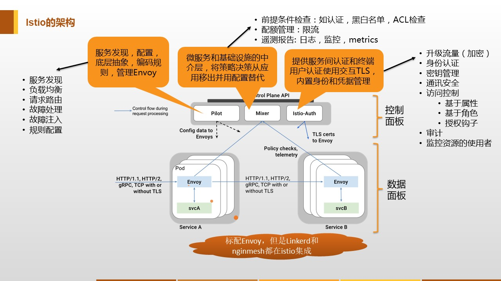
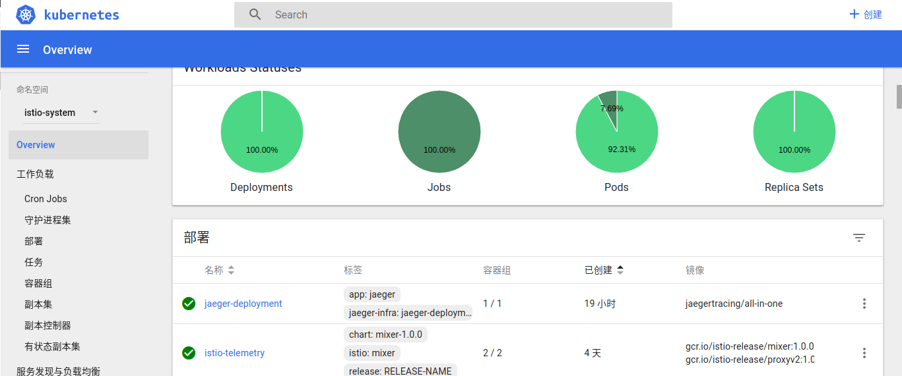
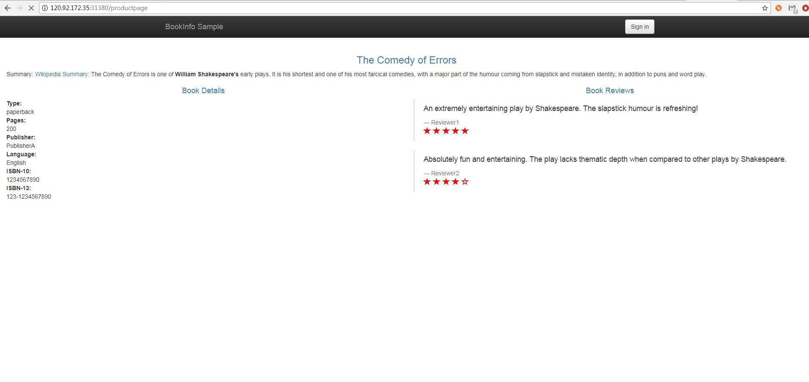

#### project-readme

遇到的问题和需要避免的一些错误的认知,提高自己的能力,我们在路上!

#### kubernetes安装运行Istio应用

2017年5月，Google、IBM和Lyft发布了开源服务网格框架Istio，提供微服务的连接、管理、监控和安全保护。Istio提供了一个服务间通信的基础设施层，解耦了应用逻辑和服务访问中版本管理、安全防护、故障转移、监控遥测等切面的问题。

“Istio”是一个希腊航海术语，意思是帆，这个很像“Kubernetes”希腊语中的舵手。随着Istio的出现，服务网格的概念兴起，Kubernetes/ OpenShift已经离开了Istio开始的地方。 Istio为开发人员和架构师提供了更丰富和更具声明性的服务发现和路由功能。

Istio是一个开放式平台，可用于连接、管理和保护微服务。 它为您提供了一种简单的方法来创建已部署服务（包括负载均衡、服务到服务认证、监视等等）的网络，而无需对服务代码进行任何更改。 要对服务添加 Istio 支持，您必须在整个环境中部署一个特殊的侧柜代理，该代理通过使用 Istio 中提供的控制平面功能来拦截微服务（已配置的微服务和受管微服务）之间的所有网络通信。

<p align="center">

</p>

组件介绍:

* Envoy

Istio 使用 Envoy 代理的扩展版本，Envoy 是以 C++ 开发的高性能代理，用于调解服务网格中所有服务的所有入站和出站流量。在 Istio 中会以Sidecar 方式跟应用运行在同一 Pod 内，一方面可以接收并执行关于规则、流量拆分等方面的指令，另一方面能够产生各种指标用于监控和跟踪。

Envoy 的许多内置功能被 istio 发扬光大，例如：

* 动态服务发现
* 负载均衡
* TLS 终止
* HTTP/2 和 gRPC 代理
* 熔断器
* 健康检查、基于百分比流量拆分的灰度发布
* 故障注入
* 丰富的度量指标

Envoy 被部署为 sidecar，和对应服务在同一个 Kubernetes pod 中。这允许 Istio 将大量关于流量行为的信号作为属性提取出来，而这些属性又可以在 Mixer 中用于执行策略决策，并发送给监控系统，以提供整个网格行为的信息。

Sidecar 代理模型还可以将 Istio 的功能添加到现有部署中，而无需重新构建或重写代码。可以阅读更多来了解为什么我们在设计目标中选择这种方式。

* Mixer

Mixer 是一个独立于平台的组件，主要进行访问控制以及策略控制，并从 Envoy 代理和其他服务收集遥测数据。代理提取请求级属性，发送到 Mixer 进行评估。有关属性提取和策略评估的更多信息，请参见 Mixer 配置。

Mixer 中包括一个灵活的插件模型，使其能够接入到各种主机环境和基础设施后端，从这些细节中抽象出 Envoy 代理和 Istio 管理的服务。

* Pilot

Pilot 为 Envoy sidecar 提供服务发现功能，为智能路由（例如 A/B 测试、金丝雀部署等）和弹性（超时、重试、熔断器等）提供流量管理功能。它将控制流量行为的高级路由规则转换为特定于 Envoy 的配置，并在运行时将它们传播到 sidecar。

Pilot 将平台特定的服务发现机制抽象化并将其合成为符合 Envoy 数据平面 API 的任何 sidecar 都可以使用的标准格式。这种松散耦合使得 Istio 能够在多种环境下运行（例如，Kubernetes、Consul、Nomad），同时保持用于流量管理的相同操作界面。

Pilot是用户和 Isito 之间的桥梁，负责接收各种配置，并发送给各个组件。

* Istio Citadel

内置认证和凭证管理，利用 TLS 提供服务之间、用户和服务之间的认证。可以用来将没有加密支持的服务升级为加密版本，并且在网络策略之外，提供服务级别的策略控制，今后还会增加更多的鉴权和审计方面的能力。

Istio的主要特点是:

1. 无需对现有服务进行变更。
2. 支持 http2、gRPC以及 TCP 流量的负载均衡和故障转移。
3. 组件可以被替换。
4. 可以进行流量监控。
5. 提供身份认证功能。
6. 拥有可以定制的路由规则。
7. 也可以进行错误处理，例如超时、重试、访问量控制、健康检查和熔断器等。

#### 安装 Istio

在安装Istio之前希望打击可以按照前面kubernetes集群文章搭建好kubernetes集群，然后开始使用Istio.

这里需要下载最新版的istio:
```bash
> curl -L https://git.io/getLatestIstio | sh -
```
然后把istio环境变量添加到系统中:

```bash
> cd istio-1.0.0/
> export PATH=$PWD/bin:$PATH
```
在istio-1.0.0中,安装目录包含：

* install/目录下的Kubernetes的安装文件.yaml
* samples/目录中的示例应用程序
* bin/目录中的istioctl客户端二进制文件。istioctl在手动注入Envoy作为附属代理并创建路由规则和策略时使用。
* istio.VERSION配置文件

其中安装文件在install目录下，istioctl执行文件在bin目录下，一些应用文件在samples目录下。

设置自动injection，自动为命名空间为default中的pod挂上Istio的sidecar：
```bash
> kubectl label namespace default istio-injection=enabled
```

我们可以先安装下istio的应用:
```bash
> kubectl apply -f install/kubernetes/istio-demo.yaml
```
运行查看service和pod:

```bash
> kubectl get pod -n istio-system
NAME                                        READY     STATUS    RESTARTS   AGE
grafana-6dd4cb7ffd-n87q4                    1/1       Running   0          2d
istio-citadel-b874fd9f5-kk6vs               1/1       Running   0          2d
istio-egressgateway-ddcdd644c-6ppq4         1/1       Running   0          2d
istio-egressgateway-ddcdd644c-7kgrc         1/1       Running   0          2d
istio-egressgateway-ddcdd644c-9n2df         1/1       Running   0          2d
istio-egressgateway-ddcdd644c-bx94h         1/1       Running   0          2d
istio-egressgateway-ddcdd644c-sd2pj         1/1       Running   0          2d
istio-galley-8985546b8-lblnm                1/1       Running   0          2d
istio-ingressgateway-7565c689cb-52zdw       1/1       Running   0          2d
istio-ingressgateway-7565c689cb-czvgb       1/1       Running   0          2d
istio-ingressgateway-7565c689cb-gm4w8       1/1       Running   0          2d
istio-ingressgateway-7565c689cb-pqxlb       1/1       Running   0          2d
istio-ingressgateway-7565c689cb-vqxhg       1/1       Running   0          2d
istio-pilot-58b5d5f-mvzrr                   2/2       Running   0          2d
istio-policy-686ff55f4f-kl4hn               2/2       Running   0          2d
istio-policy-686ff55f4f-l5q8d               2/2       Running   0          2d
istio-sidecar-injector-5d4b7b4957-lpfkr     1/1       Running   0          2d
istio-statsd-prom-bridge-58f8596c67-tfbwx   1/1       Running   0          2d
istio-telemetry-6bff9755fd-pkht9            2/2       Running   0          2d
istio-tracing-75d76fb9f-mzjpf               1/1       Running   0          2d
prometheus-884dbbcd5-p7wv7                  1/1       Running   0          2d
servicegraph-646bbc8cb4-6kvdb               1/1       Running   0          2d
```
```bash
> kubectl get svc -n istio-system
NAME                       TYPE           CLUSTER-IP      EXTERNAL-IP     PORT(S)                                                                                                     AGE
grafana                    ClusterIP      10.43.125.188   <none>          3000/TCP                                                                                                    2d
istio-citadel              ClusterIP      10.43.84.200    <none>          8060/TCP,9093/TCP                                                                                           2d
istio-egressgateway        ClusterIP      10.43.97.201    <none>          80/TCP,443/TCP                                                                                              2d
istio-galley               ClusterIP      10.43.127.149   <none>          443/TCP,9093/TCP                                                                                            2d
istio-ingressgateway       LoadBalancer   10.43.120.83    120.92.172.35   80:31380/TCP,443:31390/TCP,31400:31400/TCP,15011:30182/TCP,8060:30819/TCP,15030:32142/TCP,15031:31067/TCP   2d
istio-pilot                ClusterIP      10.43.216.64    <none>          15010/TCP,15011/TCP,8080/TCP,9093/TCP                                                                       2d
istio-policy               ClusterIP      10.43.45.54     <none>          9091/TCP,15004/TCP,9093/TCP                                                                                 2d
istio-sidecar-injector     ClusterIP      10.43.37.12     <none>          443/TCP                                                                                                     2d
istio-statsd-prom-bridge   ClusterIP      10.43.93.131    <none>          9102/TCP,9125/UDP                                                                                           2d
istio-telemetry            ClusterIP      10.43.69.34     <none>          9091/TCP,15004/TCP,9093/TCP,42422/TCP                                                                       2d
jaeger-agent               ClusterIP      None            <none>          5775/UDP,6831/UDP,6832/UDP                                                                                  2d
jaeger-collector           ClusterIP      10.43.90.61     <none>          14267/TCP,14268/TCP                                                                                         2d
jaeger-query               ClusterIP      10.43.150.244   <none>          16686/TCP                                                                                                   2d
prometheus                 ClusterIP      10.43.142.240   <none>          9090/TCP                                                                                                    2d
servicegraph               ClusterIP      10.43.224.250   <none>          8088/TCP                                                                                                    2d
tracing                    ClusterIP      10.43.7.11      <none>          80/TCP                                                                                                      2d
zipkin                     ClusterIP      10.43.136.215   <none>          9411/TCP                                                                                                    2d
```

#### 部署Istio　Bookinfo应用

在部署Istio Bookinfo应用之前，需要先查看下kubernetes的命名空间namespaces:
```bash
> kubectl get namespaces
NAME           STATUS    AGE
default        Active    8d
dev            Active    8d
istio-system   Active    2d
kube-public    Active    8d
kube-system    Active    8d
```
这里你也可以自己在新建一个命名空间test:
```bash
> kubectl create namespace test
namespace "test" created
```
但是这里我选择的是在默认的default里面部署Istio中自带的samples里的bookinfo应用，并且在sidecars之间不启用相互TLS验证,而且由于没有安装Istio-Initializer，这里必须使用istioctl kube-inject在应用程序窗口中手动注入Envoy容器，然后再部署它们：

```bash
> kubectl apply -f <(istioctl kube-inject -f samples/bookinfo/platform/kube/bookinfo.yaml)
service "details" unchanged
deployment.extensions "details-v1" configured
service "ratings" unchanged
deployment.extensions "ratings-v1" configured
service "reviews" unchanged
deployment.extensions "reviews-v1" configured
deployment.extensions "reviews-v2" configured
deployment.extensions "reviews-v3" configured
service "productpage" unchanged
deployment.extensions "productpage-v1" configured

```
创建应用的ingress gateway:
```bash
> kubectl apply -f samples/bookinfo/networking/bookinfo-gateway.yaml
gateway.networking.istio.io "bookinfo-gateway" created
virtualservice.networking.istio.io "bookinfo" created

```
确认所有的服务是否已经正确的定义和启动：
```bash
> kubectl get services
NAME          TYPE        CLUSTER-IP      EXTERNAL-IP   PORT(S)    AGE
details       ClusterIP   10.43.179.70    <none>        9080/TCP   4h
kubernetes    ClusterIP   10.43.0.1       <none>        443/TCP    11d
productpage   ClusterIP   10.43.144.63    <none>        9080/TCP   4h
ratings       ClusterIP   10.43.147.152   <none>        9080/TCP   4h
reviews       ClusterIP   10.43.44.250    <none>        9080/TCP   4h
```
查看Pods详情:
```bash
> kubectl get pods
NAME                              READY     STATUS    RESTARTS   AGE
details-v1-68db9bb8df-lm746       1/1       Running   0          4h
productpage-v1-66b9bfc74c-qlnvf   1/1       Running   0          4h
ratings-v1-dcf5694b9-zmmjm        1/1       Running   0          4h
reviews-v1-68658cc84b-sfjdm       1/1       Running   0          4h
reviews-v2-9f8987966-dch9b        1/1       Running   0          4h
reviews-v3-84b78bbd86-qdfsq       1/1       Running   0          4h

```
查看kubernetes的dashboard仪表盘可以看到:
<p align="center">

</p>


然后就可以通过 http://120.92.172.35:31380/productpage 访问bookinfo应用:

<p align="center">

</p>

到这里就可以看到部署的Istio应用成功了！

#### 参看文档
* [istio中文文档](https://preliminary.istio.io/zh/docs/setup/kubernetes/quick-start)
