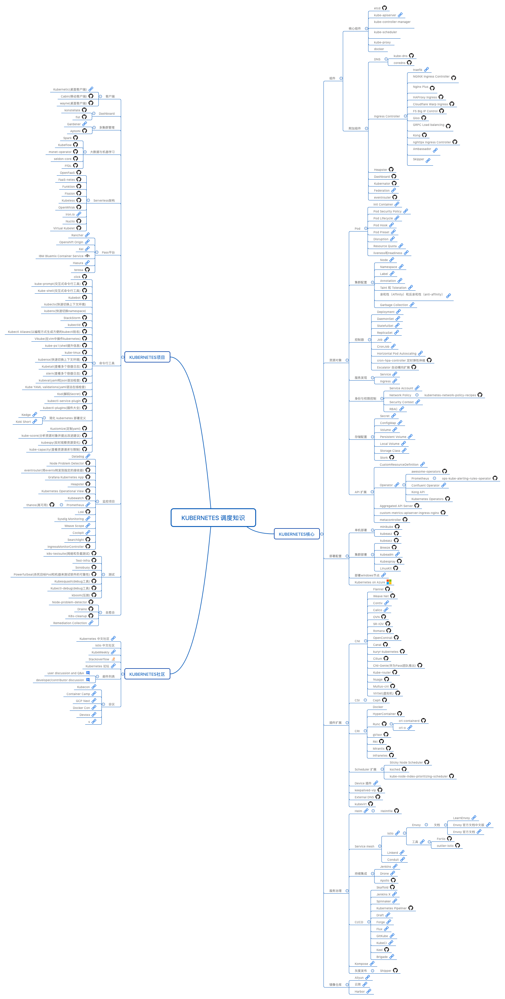

#### project-readme

遇到的问题和需要避免的一些错误的认知,提高自己的能力,我们在路上!

#### kubernetes调度知识图谱

#### kubernetes的安装

这里我们使用kubeadm搭建v1.15.3版本的Kubernetes集群.

* [kubeadm搭建集群前的准备](https://github.com/AI-algorithms/project-readme/blob/master/Kubernetes/install/kubeadm.md)
* [kubeadm搭建Kubernetes集群](https://github.com/AI-algorithms/project-readme/blob/master/Kubernetes/install/install.md)

