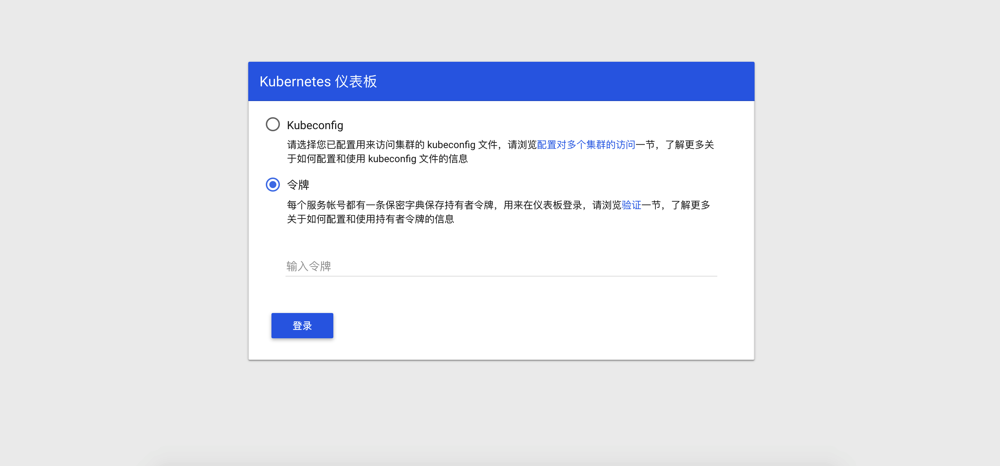
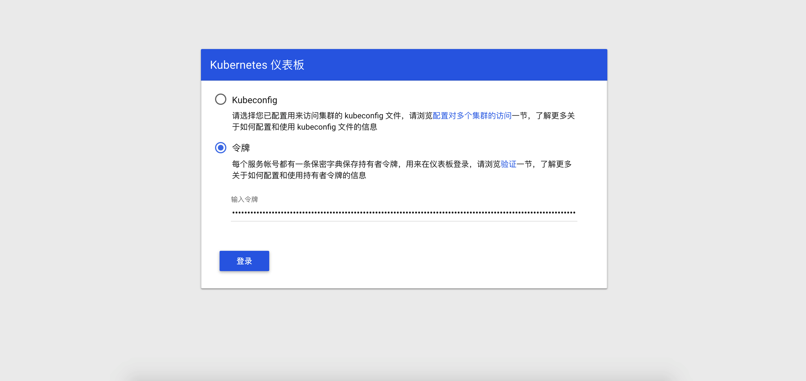
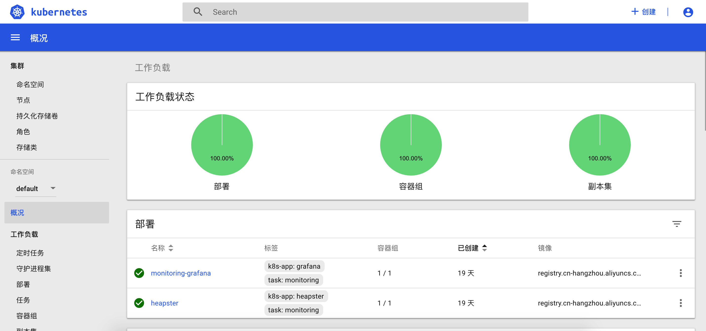

### 使用Kubeadm搭建kubernetes集群

这里我们通过 Kubeadm 来搭建最新版本的 Kubernetes 1.15.3 集群，其实和以前搭建的方式方法基本上一致. 我们这里使用 calico 网络插件以及 ipvs 模式的 kube-proxy。

#### 使用Kubeadm搭建kubernetes集群的前期准备

- [Docker安装, 选择适配操作系统的版本](<https://docs.docker.com/install/linux/docker-ce/centos/>)

- [Kubectl, Kubelet, Kubeadm安装](<https://kubernetes.io/zh/docs/setup/independent/install-kubeadm/>)

Kubectl, Kubelet, Kubeadm墙内安装, 我这里是centos, 不同操作系统查找相应的安装配置方式

```bash
cat <<EOF > /etc/yum.repos.d/kubernetes.repo
[kubernetes]
name=Kubernetes
baseurl=https://mirrors.aliyun.com/kubernetes/yum/repos/kubernetes-el7-x86_64
enabled=1
gpgcheck=1
repo_gpgcheck=1
gpgkey=https://mirrors.aliyun.com/kubernetes/yum/doc/yum-key.gpg https://mirrors.aliyun.com/kubernetes/yum/doc/rpm-package-key.gpg
EOF
# 安装
yum install -y kubectl kubelet kubeadm
# 开机启动
systemctl enable kubelet
# 启动
systemctl start kubelet
```

- [配置docker,Cgroup驱动, 以及阿里云镜像加速地址](<https://kubernetes.io/docs/setup/production-environment/container-runtimes/>)

```bash
# Setup daemon.
cat > /etc/docker/daemon.json <<EOF
{
"registry-mirrors": ["https://xxxx.mirror.aliyuncs.com"],
  "exec-opts": ["native.cgroupdriver=systemd"],
  "log-driver": "json-file",
  "log-opts": {
    "max-size": "100m"
  },
  "storage-driver": "overlay2",
  "storage-opts": [
    "overlay2.override_kernel_check=true"
  ]
}
```

- 拉取所需镜像

```bash
// 拉取阿里云镜像仓库中的公共镜像
sudo docker pull registry.cn-hangzhou.aliyuncs.com/mirror_google_containers/kube-controller-manager:v1.14.1
sudo docker pull registry.cn-hangzhou.aliyuncs.com/mirror_google_containers/kube-apiserver:v1.14.1
sudo docker pull registry.cn-hangzhou.aliyuncs.com/mirror_google_containers/kube-scheduler:v1.14.1
sudo docker pull registry.cn-hangzhou.aliyuncs.com/mirror_google_containers/kube-proxy:v1.14.1
sudo docker pull registry.cn-hangzhou.aliyuncs.com/mirror_google_containers/pause:3.1
sudo docker pull registry.cn-hangzhou.aliyuncs.com/jxqc/etcd:3.3.10
sudo docker pull registry.cn-hangzhou.aliyuncs.com/jxqc/coredns:1.3.1
sudo docker pull registry.cn-hangzhou.aliyuncs.com/kuberneters/kubernetes-dashboard-amd64:v1.10.1
// 为拉取的镜像重新打tag
sudo docker tag registry.cn-hangzhou.aliyuncs.com/mirror_google_containers/kube-controller-manager:v1.14.1     k8s.gcr.io/kube-controller-manager:v1.14.1
sudo docker tag registry.cn-hangzhou.aliyuncs.com/mirror_google_containers/kube-apiserver:v1.14.1                          k8s.gcr.io/kube-apiserver:v1.14.1
sudo docker tag registry.cn-hangzhou.aliyuncs.com/mirror_google_containers/kube-scheduler:v1.14.1                         k8s.gcr.io/kube-scheduler:v1.14.1
sudo docker tag registry.cn-hangzhou.aliyuncs.com/mirror_google_containers/kube-proxy:v1.14.1                                  k8s.gcr.io/kube-proxy:v1.14.1
sudo docker tag registry.cn-hangzhou.aliyuncs.com/mirror_google_containers/pause:3.1                                                      k8s.gcr.io/pause:3.1
sudo docker tag registry.cn-hangzhou.aliyuncs.com/jxqc/etcd:3.3.10                                                                                                 k8s.gcr.io/etcd:3.3.10
sudo docker tag registry.cn-hangzhou.aliyuncs.com/jxqc/coredns:1.3.1                                                                                            k8s.gcr.io/coredns:1.3.1
sudo docker tag registry.cn-hangzhou.aliyuncs.com/kuberneters/kubernetes-dashboard-amd64:v1.10.1                      k8s.gcr.io/kubernetes-dashboard-amd64:v1.10.1

// 删除无用的镜像
sudo docker rmi registry.cn-hangzhou.aliyuncs.com/mirror_google_containers/kube-controller-manager:v1.14.1
sudo docker rmi registry.cn-hangzhou.aliyuncs.com/mirror_google_containers/kube-apiserver:v1.14.1
sudo docker rmi registry.cn-hangzhou.aliyuncs.com/mirror_google_containers/kube-scheduler:v1.14.1
sudo docker rmi registry.cn-hangzhou.aliyuncs.com/mirror_google_containers/kube-proxy:v1.14.1
sudo docker rmi registry.cn-hangzhou.aliyuncs.com/mirror_google_containers/pause:3.1
sudo docker rmi registry.cn-hangzhou.aliyuncs.com/jxqc/etcd:3.3.10
sudo docker rmi registry.cn-hangzhou.aliyuncs.com/jxqc/coredns:1.3.1
sudo docker rmi registry.cn-hangzhou.aliyuncs.com/kuberneters/kubernetes-dashboard-amd64:v1.10.1
```

- 用以上相同配置去配置一台子节点

配置Master节点的Kubelet驱动, 修改 `--cgroup-driver=cgroupfs` 为  `--cgroup-driver=systemd`.

```bash
> sudo vi /etc/systemd/system/kubelet.service.d/10-kubeadm.conf
```

```bash
[Unit]
Wants=docker.socket

[Service]
ExecStart=
ExecStart=/usr/bin/kubelet --allow-privileged=true --authorization-mode=Webhook --bootstrap-kubeconfig=/etc/kubernetes/bootstrap-kubelet.conf --cgroup-driver=systemd --client-ca-file=/etc/kubernetes/pki/ca.crt --cluster-dns=10.96.0.10 --cluster-domain=cluster.local --container-runtime=docker --fail-swap-on=false --kubeconfig=/etc/kubernetes/kubelet.conf --pod-manifest-path=/etc/kubernetes/manifests

[Install]
```

- Master节点初始化

```bash
> sudo kubeadm init --apiserver-advertise-address 192.168.0.109 --pod-network-cidr=10.244.0.0/16
```

```bash
I0619 21:09:34.578805   30353 version.go:96] could not fetch a Kubernetes version from the internet: unable to get URL "https://dl.k8s.io/release/stable-1.txt": Get https://dl.k8s.io/release/stable-1.txt: net/http: request canceled while waiting for connection (Client.Timeout exceeded while awaiting headers)
I0619 21:09:34.578939   30353 version.go:97] falling back to the local client version: v1.14.1
[init] Using Kubernetes version: v1.14.1
[preflight] Running pre-flight checks
[preflight] Pulling images required for setting up a Kubernetes cluster
[preflight] This might take a minute or two, depending on the speed of your internet connection
[preflight] You can also perform this action in beforehand using 'kubeadm config images pull'
[kubelet-start] Writing kubelet environment file with flags to file "/var/lib/kubelet/kubeadm-flags.env"
[kubelet-start] Writing kubelet configuration to file "/var/lib/kubelet/config.yaml"
[kubelet-start] Activating the kubelet service
[certs] Using certificateDir folder "/etc/kubernetes/pki"
[certs] Generating "front-proxy-ca" certificate and key
[certs] Generating "front-proxy-client" certificate and key
[certs] Generating "etcd/ca" certificate and key
[certs] Generating "etcd/peer" certificate and key
[certs] etcd/peer serving cert is signed for DNS names [chen localhost] and IPs [192.168.0.109 127.0.0.1 ::1]
[certs] Generating "apiserver-etcd-client" certificate and key
[certs] Generating "etcd/server" certificate and key
[certs] etcd/server serving cert is signed for DNS names [chen localhost] and IPs [192.168.0.109 127.0.0.1 ::1]
[certs] Generating "etcd/healthcheck-client" certificate and key
[certs] Generating "ca" certificate and key
[certs] Generating "apiserver" certificate and key
[certs] apiserver serving cert is signed for DNS names [chen kubernetes kubernetes.default kubernetes.default.svc kubernetes.default.svc.cluster.local] and IPs [10.96.0.1 192.168.0.109]
[certs] Generating "apiserver-kubelet-client" certificate and key
[certs] Generating "sa" key and public key
[kubeconfig] Using kubeconfig folder "/etc/kubernetes"
[kubeconfig] Writing "admin.conf" kubeconfig file
[kubeconfig] Writing "kubelet.conf" kubeconfig file
[kubeconfig] Writing "controller-manager.conf" kubeconfig file
[kubeconfig] Writing "scheduler.conf" kubeconfig file
[control-plane] Using manifest folder "/etc/kubernetes/manifests"
[control-plane] Creating static Pod manifest for "kube-apiserver"
[control-plane] Creating static Pod manifest for "kube-controller-manager"
[control-plane] Creating static Pod manifest for "kube-scheduler"
[etcd] Creating static Pod manifest for local etcd in "/etc/kubernetes/manifests"
[wait-control-plane] Waiting for the kubelet to boot up the control plane as static Pods from directory "/etc/kubernetes/manifests". This can take up to 4m0s
[apiclient] All control plane components are healthy after 16.003603 seconds
[upload-config] storing the configuration used in ConfigMap "kubeadm-config" in the "kube-system" Namespace
[kubelet] Creating a ConfigMap "kubelet-config-1.14" in namespace kube-system with the configuration for the kubelets in the cluster
[upload-certs] Skipping phase. Please see --experimental-upload-certs
[mark-control-plane] Marking the node chen as control-plane by adding the label "node-role.kubernetes.io/master=''"
[mark-control-plane] Marking the node chen as control-plane by adding the taints [node-role.kubernetes.io/master:NoSchedule]
[bootstrap-token] Using token: qg3ci5.kvvoglj9lxejc3ij
[bootstrap-token] Configuring bootstrap tokens, cluster-info ConfigMap, RBAC Roles
[bootstrap-token] configured RBAC rules to allow Node Bootstrap tokens to post CSRs in order for nodes to get long term certificate credentials
[bootstrap-token] configured RBAC rules to allow the csrapprover controller automatically approve CSRs from a Node Bootstrap Token
[bootstrap-token] configured RBAC rules to allow certificate rotation for all node client certificates in the cluster
[bootstrap-token] creating the "cluster-info" ConfigMap in the "kube-public" namespace
[addons] Applied essential addon: CoreDNS
[addons] Applied essential addon: kube-proxy

Your Kubernetes control-plane has initialized successfully!

To start using your cluster, you need to run the following as a regular user:

  mkdir -p $HOME/.kube
  sudo cp -i /etc/kubernetes/admin.conf $HOME/.kube/config
  sudo chown $(id -u):$(id -g) $HOME/.kube/config

You should now deploy a pod network to the cluster.
Run "kubectl apply -f [podnetwork].yaml" with one of the options listed at:
  https://kubernetes.io/docs/concepts/cluster-administration/addons/

Then you can join any number of worker nodes by running the following on each as root:

kubeadm join 192.168.0.109:6443 --token qg3ci5.kvvoglj9lxejc3ij \
    --discovery-token-ca-cert-hash sha256:3a2af178182529a7e163260ec80f546edce98213c252cb0e6fdc0158a5cc876a 
```

- Master切换到CKL

```bash
mv  $HOME/.kube $HOME/.kube.bak
mkdir -p $HOME/.kube
sudo cp -i /etc/kubernetes/admin.conf $HOME/.kube/config
sudo chown $(id -u):$(id -g) $HOME/.kube/config
```

- 开启flannel网络插件
```bash
> kubectl apply -f https://raw.githubusercontent.com/coreos/flannel/master/Documentation/kube-flannel.yml
```

- 开启dashboard服务

```bash
> kubectl apply -f https://raw.githubusercontent.com/kubernetes/dashboard/v1.10.1/src/deploy/recommended/kubernetes-dashboard.yaml
```

- 子节点加入主节点集群

```bash
> kubeadm join 192.168.0.109:6443 --token qg3ci5.kvvoglj9lxejc3ij  --discovery-token-ca-cert-hash sha256:3a2af178182529a7e163260ec80f546edce98213c252cb0e6fdc0158a5cc876a 
```

- 主节点查看集群

```bash
> sudo kubectl get nodes
NAME    STATUS   ROLES    AGE   VERSION
bogon   Ready    <none>   45m   v1.14.3
chen    Ready    master   71m   v1.14.1
```

- 查看集群中的pod,本地nameserver 127.0.0.53导致coredns的CrashLoopBackOff

```bash
~/kubernetes > sudo kubectl get pod --all-namespaces
NAMESPACE     NAME                                    READY   STATUS             RESTARTS   AGE
kube-system   coredns-fb8b8dccf-rjjfh                 0/1     CrashLoopBackOff   9          21m
kube-system   coredns-fb8b8dccf-vgrx5                 0/1     CrashLoopBackOff   9          21m
kube-system   etcd-chen                               1/1     Running            0          20m
kube-system   kube-apiserver-chen                     1/1     Running            0          20m
kube-system   kube-controller-manager-chen            1/1     Running            0          20m
kube-system   kube-flannel-ds-amd64-8hf89             1/1     Running            0          20m
kube-system   kube-flannel-ds-amd64-vs5pv             1/1     Running            0          17m
kube-system   kube-proxy-mrvgk                        1/1     Running            0          17m
kube-system   kube-proxy-pbwjw                        1/1     Running            0          21m
kube-system   kube-scheduler-chen                     1/1     Running            0          20m
kube-system   kubernetes-dashboard-5f7b999d65-jgnrq   1/1     Running            0          11m
```

- [创建一个amdin-user, 并绑定一个管理员角色](<https://github.com/kubernetes/dashboard/wiki/Creating-sample-user>)

```bash
> vi  dashboard-adminuser-create.yaml
apiVersion: v1
kind: ServiceAccount
metadata:
  name: admin-user
  namespace: kube-system
```

创建用户:

```
> sudo kubectl apply -f dashboard-adminuser-create.yaml
```


```bash
> vi dashboard-adminuser-role-binding.yaml

apiVersion: rbac.authorization.k8s.io/v1
kind: ClusterRoleBinding
metadata:
  name: admin-user
roleRef:
  apiGroup: rbac.authorization.k8s.io
  kind: ClusterRole
  name: cluster-admin
subjects:
- kind: ServiceAccount
  name: admin-user
  namespace: kube-system
```

为用户绑定角色:

```bash
> sudo kubectl apply -f dashboard-adminuser-role-binding.yaml
```

- 启动dashboard

Kubernetes提供了以下四种访问服务的方式：

* kubectl proxy

kubectl proxy它在你的服务器与Kubernetes API之间创建一个代理，默认情况下，只能从本地访问（启动它的机器）。
```bash
> kubectl --namespace=kube-system get deployment kubernetes-dashboard
> sudo kubectl proxy          # 只能本地访问,
Starting to serve on 127.0.0.1:8001
```
我们也可以使用`--address`和`--accept-hosts`参数来允许外部访问：

```bash
> sudo kubectl proxy --address='0.0.0.0' --accept-hosts='^*$'  # 外部可访问
```    

然后我们在外网访问`http://<master-ip>:8001/api/v1/namespaces/kube-system/services/https:kubernetes-dashboard:/proxy/`，可以成功访问到登录界面，但是却无法登录，这是因为Dashboard只允许`localhost`和`127.0.0.1`使用HTTP连接进行访问，而其它地址只允许使用HTTPS。
因此，如果需要在非本机访问Dashboard的话，只能选择其他访问方式。


* NodePort

NodePort是将节点直接暴露在外网的一种方式，只建议在开发环境，单节点的安装方式中使用。

启用NodePort很简单，只需执行`kubectl edit`命令进行编辑：
```bash
> sudo kubectl -n kube-system edit service kubernetes-dashboard
```
输出如下：
```bash
apiVersion: v1
kind: Service
metadata:
  annotations:
    kubectl.kubernetes.io/last-applied-configuration: |
      {"apiVersion":"v1","kind":"Service","metadata":{"annotations":{},"labels":{"k8s-app":"kubernetes-dashboard"},"name":"kubernetes-dashboard","namespace":"kube-system"},"spec":{"ports":[{"port":443,"targetPort":8443}],"selector":{"k8s-app":"kubernetes-dashboard"}}}
  creationTimestamp: 2018-05-01T07:23:41Z
  labels:
    k8s-app: kubernetes-dashboard
  name: kubernetes-dashboard
  namespace: kube-system
  resourceVersion: "1750"
  selfLink: /api/v1/namespaces/kube-system/services/kubernetes-dashboard
  uid: 9329577a-4d10-11e8-a548-00155d000529
spec:
  clusterIP: 10.103.5.139
  ports:
  - port: 443
    protocol: TCP
    targetPort: 8443
  selector:
    k8s-app: kubernetes-dashboard
  sessionAffinity: None
  type: ClusterIP
status:
  loadBalancer: {}
```
然后我们将上面的 `type: ClusterIP` 修改为 `type: NodePort` ,保存后使用`kubectl get service`命令来查看自动生产的端口：
```bash
> kubectl -n kube-system get service kubernetes-dashboard
NAME         TYPE        CLUSTER-IP   EXTERNAL-IP   PORT(S)   AGE
kubernetes   ClusterIP   10.96.0.1    <none>        443/TCP   4d11h
```

如上所示，`Dashboard`已经在31795端口上公开，现在可以在外部使用`https://<cluster-ip>:31795`进行访问。
需要注意的是，在多节点的集群中，必须找到运行`Dashboard`节点的IP来访问，而不是Master节点的IP，在本文的示例，我部署了两台服务器，MatserIP为192.168.0.109，ClusterIP为192.168.0.110。

遗憾的是，由于证书问题，我们无法访问，需要在部署Dashboard时指定有效的证书，才可以访问。
由于在正式环境中，并不推荐使用NodePort的方式来访问Dashboard，因此,关于如何为Dashboard配置证书可参考：
[Certificate Management](https://github.com/kubernetes/dashboard/wiki/Certificate-management)

* API Server

如果Kubernetes API服务器是公开的，并可以从外部访问，那我们可以直接使用API Server的方式来访问，也是比较推荐的方式。

Dashboard的访问地址为：
```markdown
https://<master-ip>:<apiserver-port>/api/v1/namespaces/kube-system/services/https:kubernetes-dashboard:/proxy/
```
但是返回的结果可能如下：
```bash
{
  "kind": "Status",
  "apiVersion": "v1",
  "metadata": {
    
  },
  "status": "Failure",
  "message": "services \"https:kubernetes-dashboard:\" is forbidden: User \"system:anonymous\" cannot get services/proxy in the namespace \"kube-system\"",
  "reason": "Forbidden",
  "details": {
    "name": "https:kubernetes-dashboard:",
    "kind": "services"
  },
  "code": 403
}
```
这是因为最新版的k8s默认启用了RBAC，并为未认证用户赋予了一个默认的身份：`anonymous`。

对于API Server来说，它是使用证书进行认证的，我们需要先创建一个证书：

* 首先找到kubectl命令的配置文件，默认情况下为`/etc/kubernetes/admin.conf`，在 上一篇 中，我们已经复制到了`$HOME/.kube/config中`。

* 然后我们使用`client-certificate-data`和`client-key-data`生成一个p12文件，可使用下列命令：

```bash
# 生成client-certificate-data
> grep 'client-certificate-data' ~/.kube/config | head -n 1 | awk '{print $2}' | base64 -d >> kubecfg.crt

# 生成client-key-data
> grep 'client-key-data' ~/.kube/config | head -n 1 | awk '{print $2}' | base64 -d >> kubecfg.key

# 生成p12
> openssl pkcs12 -export -clcerts -inkey kubecfg.key -in kubecfg.crt -out kubecfg.p12 -name "kubernetes-client"
```

我们可以使用一开始创建的admin-user用户的token进行登录，一切OK。

注意:对于生产系统，我们应该为每个用户应该生成自己的证书，因为不同的用户会有不同的命名空间访问权限。
   
* Ingress

Ingress将开源的反向代理负载均衡器（如 Nginx、Apache、Haproxy等）与k8s进行集成，并可以动态的更新Nginx配置等，是比较灵活，更为推荐的暴露服务的方式.


- 生成admin-user的登录令牌

`sudo kubectl -n kube-system describe secret $(kubectl -n kube-system get secret | grep admin-user | awk '{print $1}')`

- 访问dashboard

```bash
http://localhost:8001/api/v1/namespaces/kube-system/services/https:kubernetes-dashboard:/proxy/#!/login
```

#### 环境准备

3个节点，都是 Centos 7.6 系统，内核版本：3.10.0-957.12.2.el7.x86_64，在每个节点上添加 hosts 信息：

```bash
$ cat /etc/hosts

10.151.30.11 master

10.151.30.22 node1

10.151.30.23 node2
```

禁用防火墙：
```bash
$ systemctl stop firewalld

$ systemctl disable firewalld
```

禁用SELINUX：

```bash

$ setenforce 0

$ cat /etc/selinux/config
SELINUX=disabled
```

创建 /etc/sysctl.d/k8s.conf文件，添加如下内容：

```bash
net.bridge.bridge-nf-call-ip6tables = 1
net.bridge.bridge-nf-call-iptables = 1
net.ipv4.ip_forward = 1
```
执行如下命令使修改生效：

```bash
$ modprobe br_netfilter
$ sysctl -p /etc/sysctl.d/k8s.conf
```

安装 ipvs:
```bash

$ cat > /etc/sysconfig/modules/ipvs.modules <<EOF
#!/bin/bash
modprobe -- ip_vs
modprobe -- ip_vs_rr
modprobe -- ip_vs_wrr
modprobe -- ip_vs_sh
modprobe -- nf_conntrack_ipv4
EOF

$ chmod 755 /etc/sysconfig/modules/ipvs.modules && bash /etc/sysconfig/modules/ipvs.modules && lsmod | grep -e ip_vs -e nf_conntrack_ipv4
```

上面脚本创建了的 /etc/sysconfig/modules/ipvs.modules文件，保证在节点重启后能自动加载所需模块。使用 lsmod|grep-e ip_vs-e nf_conntrack_ipv4命令查看是否已经正确加载所需的内核模块。

接下来还需要确保各个节点上已经安装了 ipset 软件包：
```bash
$ yum install ipset
```

为了便于查看 ipvs 的代理规则，最好安装一下管理工具 ipvsadm：
```bash
$ yum install ipvsadm
```
同步服务器时间:
```bash

$ yum install chrony -y

$ systemctl enable chronyd

$ systemctl start chronyd

$ chronyc sources

210 Number of sources = 4

MS Name/IP address         Stratum Poll Reach LastRx Last sample

===============================================================================

^+ sv1.ggsrv.de                  2   6    17    32   -823us[-1128us] +/-   98ms

^- montreal.ca.logiplex.net      2   6    17    32    -17ms[  -17ms] +/-  179ms

^- ntp6.flashdance.cx            2   6    17    32    -32ms[  -32ms] +/-  161ms

^* 119.28.183.184                2   6    33    32   +661us[ +357us] +/-   38ms

$ date
Tue Aug 28 09:28:41 CST 2019
```

关闭 swap 分区：
```bash
$ swapoff -a 
```

修改 /etc/fstab文件，注释掉 SWAP 的自动挂载，使用 free-m确认 swap 已经关闭。swappiness 参数调整，修改 /etc/sysctl.d/k8s.conf添加下面一行：
```bash
vm.swappiness=0
```

执行 sysctl-p/etc/sysctl.d/k8s.conf使修改生效。


接下来可以安装 Docker:
```bash

$ yum install -y yum-utils \

  device-mapper-persistent-data \

  lvm2

$ yum-config-manager \

    --add-repo \

    https://download.docker.com/linux/centos/docker-ce.repo

$ yum list docker-ce --showduplicates | sort -r

 * updates: mirrors.tuna.tsinghua.edu.cn

Loading mirror speeds from cached hostfile

Loaded plugins: fastestmirror, langpacks

Installed Packages

 * extras: mirrors.tuna.tsinghua.edu.cn

 * epel: mirrors.yun-idc.com

docker-ce.x86_64            3:19.03.1-3.el7                     docker-ce-stable

docker-ce.x86_64            3:19.03.0-3.el7                     docker-ce-stable

docker-ce.x86_64            3:18.09.8-3.el7                     docker-ce-stable

......

docker-ce.x86_64            18.03.1.ce-1.el7.centos             docker-ce-stable

docker-ce.x86_64            18.03.0.ce-1.el7.centos             docker-ce-stable

......

 * base: mirror.lzu.edu.cn
Available Packages
```

可以选择安装一个版本，比如我们这里安装最新版本：

```bash
$ yum install docker-ce-19.03.1-3.el7
```

配置 Docker 镜像加速器:
```bash

$ vi /etc/docker/daemon.json

{

  "exec-opts": ["native.cgroupdriver=systemd"],

  "registry-mirrors" : [

    "https://ot2k4d59.mirror.aliyuncs.com/"

  ]

}
```

启动 Docker:
```bash
$ systemctl start docker
$ systemctl enable docker
```

在确保 Docker 安装完成后，上面的相关环境配置也完成了，现在我们就可以来安装 Kubeadm 了，我们这里是通过指定yum 源的方式来进行安装的：
```bash
cat <<EOF > /etc/yum.repos.d/kubernetes.repo

[kubernetes]

name=Kubernetes

baseurl=https://packages.cloud.google.com/yum/repos/kubernetes-el7-x86_64

enabled=1

gpgcheck=1

repo_gpgcheck=1

gpgkey=https://packages.cloud.google.com/yum/doc/yum-key.gpg

        https://packages.cloud.google.com/yum/doc/rpm-package-key.gpg

EOF
```

当然了，上面的 yum 源是需要科学上网的，如果不能科学上网的话，我们可以使用阿里云的源进行安装：
```bash

cat <<EOF > /etc/yum.repos.d/kubernetes.repo

[kubernetes]

name=Kubernetes

baseurl=http://mirrors.aliyun.com/kubernetes/yum/repos/kubernetes-el7-x86_64

enabled=1

gpgcheck=0

repo_gpgcheck=0

gpgkey=http://mirrors.aliyun.com/kubernetes/yum/doc/yum-key.gpg

        http://mirrors.aliyun.com/kubernetes/yum/doc/rpm-package-key.gpg

EOF
```

然后安装 kubeadm、kubelet、kubectl：
```bash
$ yum install -y kubelet kubeadm kubectl --disableexcludes=kubernetes

$ kubeadm version

kubeadm version: &version.Info{Major:"1", Minor:"15", GitVersion:"v1.15.3", GitCommit:"2d3c76f9091b6bec110a5e63777c332469e0cba2", GitTreeState:"clean", BuildDate:"2019-08-19T11:11:18Z", GoVersion:"go1.12.9", Compiler:"gc", Platform:"linux/amd64"}
```
可以看到我们这里安装的是 v1.15.3 版本，然后将 kubelet 设置成开机启动：

```bash
$ systemctl enable kubelet.service
```

```markdown
注意: 到这里为止上面所有的操作都需要在所有节点执行配置。
```

#### 初始化集群

然后接下来在 master 节点配置 kubeadm 初始化文件，可以通过如下命令导出默认的初始化配置：
```bash
$ kubeadm config print init-defaults > kubeadm.yaml
```
然后根据我们自己的需求修改配置，比如修改 imageRepository 的值，kube-proxy 的模式为 ipvs，另外需要注意的是我们这里是准备安装 calico 网络插件的，需要将networking.podSubnet设置为 192.168.0.0/16：
```yaml
apiVersion: kubeadm.k8s.io/v1beta2

bootstrapTokens:

- groups:

  - system:bootstrappers:kubeadm:default-node-token

  token: abcdef.0123456789abcdef

  ttl: 24h0m0s

  usages:

  - signing

  - authentication

kind: InitConfiguration

localAPIEndpoint:

  advertiseAddress: 10.151.30.11  # apiserver 节点内网IP

  bindPort: 6443

nodeRegistration:

  criSocket: /var/run/dockershim.sock

  name: ydzs-master

  taints:

  - effect: NoSchedule

    key: node-role.kubernetes.io/master

---

apiServer:

  timeoutForControlPlane: 4m0s

apiVersion: kubeadm.k8s.io/v1beta2

certificatesDir: /etc/kubernetes/pki

clusterName: kubernetes

controllerManager: {}

dns:

  type: CoreDNS  # dns类型

etcd:

  local:

    dataDir: /var/lib/etcd

imageRepository: gcr.azk8s.cn/google_containers

kind: ClusterConfiguration

kubernetesVersion: v1.15.3  # k8s版本

networking:

  dnsDomain: cluster.local

  podSubnet: 192.168.0.0/16

  serviceSubnet: 10.96.0.0/12

scheduler: {}

---

apiVersion: kubeproxy.config.k8s.io/v1alpha1

kind: KubeProxyConfiguration

mode: ipvs  # kube-proxy 模式
```

然后使用上面的配置文件进行初始化：
```bash

$ kubeadm init --config kubeadm.yaml

[init] Using Kubernetes version: v1.15.3

[preflight] Running pre-flight checks

    [WARNING SystemVerification]: this Docker version is not on the list of validated versions: 19.03.1. Latest validated version: 18.09

[preflight] Pulling images required for setting up a Kubernetes cluster

[preflight] This might take a minute or two, depending on the speed of your internet connection

[preflight] You can also perform this action in beforehand using 'kubeadm config images pull'

[kubelet-start] Writing kubelet environment file with flags to file "/var/lib/kubelet/kubeadm-flags.env"

[kubelet-start] Writing kubelet configuration to file "/var/lib/kubelet/config.yaml"

[kubelet-start] Activating the kubelet service

[certs] Using certificateDir folder "/etc/kubernetes/pki"

[certs] Generating "etcd/ca" certificate and key

[certs] Generating "etcd/server" certificate and key

[certs] etcd/server serving cert is signed for DNS names [ydzs-master localhost] and IPs [10.151.30.11 127.0.0.1 ::1]

[certs] Generating "etcd/peer" certificate and key

[certs] etcd/peer serving cert is signed for DNS names [ydzs-master localhost] and IPs [10.151.30.11 127.0.0.1 ::1]

[certs] Generating "apiserver-etcd-client" certificate and key

[certs] Generating "etcd/healthcheck-client" certificate and key

[certs] Generating "ca" certificate and key

[certs] Generating "apiserver" certificate and key

[certs] apiserver serving cert is signed for DNS names [ydzs-master kubernetes kubernetes.default kubernetes.default.svc kubernetes.default.svc.cluster.local] and IPs [10.96.0.1 10.151.30.11]

[certs] Generating "apiserver-kubelet-client" certificate and key

[certs] Generating "front-proxy-ca" certificate and key

[certs] Generating "front-proxy-client" certificate and key

[certs] Generating "sa" key and public key

[kubeconfig] Using kubeconfig folder "/etc/kubernetes"

[kubeconfig] Writing "admin.conf" kubeconfig file

[kubeconfig] Writing "kubelet.conf" kubeconfig file

[kubeconfig] Writing "controller-manager.conf" kubeconfig file

[kubeconfig] Writing "scheduler.conf" kubeconfig file

[control-plane] Using manifest folder "/etc/kubernetes/manifests"

[control-plane] Creating static Pod manifest for "kube-apiserver"

[control-plane] Creating static Pod manifest for "kube-controller-manager"

[control-plane] Creating static Pod manifest for "kube-scheduler"

[etcd] Creating static Pod manifest for local etcd in "/etc/kubernetes/manifests"

[wait-control-plane] Waiting for the kubelet to boot up the control plane as static Pods from directory "/etc/kubernetes/manifests". This can take up to 4m0s

[kubelet-check] Initial timeout of 40s passed.

[apiclient] All control plane components are healthy after 42.012149 seconds

[upload-config] Storing the configuration used in ConfigMap "kubeadm-config" in the "kube-system" Namespace

[kubelet] Creating a ConfigMap "kubelet-config-1.15" in namespace kube-system with the configuration for the kubelets in the cluster

[upload-certs] Skipping phase. Please see --upload-certs

[mark-control-plane] Marking the node ydzs-master as control-plane by adding the label "node-role.kubernetes.io/master=''"

[mark-control-plane] Marking the node ydzs-master as control-plane by adding the taints [node-role.kubernetes.io/master:NoSchedule]

[bootstrap-token] Using token: abcdef.0123456789abcdef

[bootstrap-token] Configuring bootstrap tokens, cluster-info ConfigMap, RBAC Roles

[bootstrap-token] configured RBAC rules to allow Node Bootstrap tokens to post CSRs in order for nodes to get long term certificate credentials

[bootstrap-token] configured RBAC rules to allow the csrapprover controller automatically approve CSRs from a Node Bootstrap Token

[bootstrap-token] configured RBAC rules to allow certificate rotation for all node client certificates in the cluster

[bootstrap-token] Creating the "cluster-info" ConfigMap in the "kube-public" namespace

[addons] Applied essential addon: CoreDNS

[addons] Applied essential addon: kube-proxy

Your Kubernetes control-plane has initialized successfully!

To start using your cluster, you need to run the following as a regular user:

  mkdir -p $HOME/.kube

  sudo cp -i /etc/kubernetes/admin.conf $HOME/.kube/config

  sudo chown $(id -u):$(id -g) $HOME/.kube/config

You should now deploy a pod network to the cluster.

Run "kubectl apply -f [podnetwork].yaml" with one of the options listed at:

  https://kubernetes.io/docs/concepts/cluster-administration/addons/

Then you can join any number of worker nodes by running the following on each as root:

kubeadm join 10.151.30.11:6443 --token abcdef.0123456789abcdef \

    --discovery-token-ca-cert-hash sha256:deb5158b39948a4592ff48512047ea6e45b288c248872724a28f15008962178b
```

```markdown
可以看到最新验证的 docker 版本是18.09，虽然是一个 warning，所以最好还是安装18.09版本的 docker。
```

拷贝 kubeconfig 文件:
```bash
$ mkdir -p $HOME/.kube
$ sudo cp -i /etc/kubernetes/admin.conf $HOME/.kube/config
$ sudo chown $(id -u):$(id -g) $HOME/.kube/config
```

添加节点:
```bash

$ kubeadm join 10.151.30.11:6443 --token abcdef.0123456789abcdef \

    --discovery-token-ca-cert-hash sha256:deb5158b39948a4592ff48512047ea6e45b288c248872724a28f15008962178b

[preflight] Reading configuration from the cluster...

[preflight] FYI: You can look at this config file with 'kubectl -n kube-system get cm kubeadm-config -oyaml'

[kubelet-start] Downloading configuration for the kubelet from the "kubelet-config-1.15" ConfigMap in the kube-system namespace

[kubelet-start] Writing kubelet configuration to file "/var/lib/kubelet/config.yaml"

[kubelet-start] Writing kubelet environment file with flags to file "/var/lib/kubelet/kubeadm-flags.env"

[kubelet-start] Activating the kubelet service

[kubelet-start] Waiting for the kubelet to perform the TLS Bootstrap...

This node has joined the cluster:

* Certificate signing request was sent to apiserver and a response was received.

* The Kubelet was informed of the new secure connection details.

Run 'kubectl get nodes' on the control-plane to see this node join the cluster.
```

```markdown
如果忘记了上面的 join 命令可以使用命令 kubeadm token create--print-join-command重新获取。
```

执行成功后运行 get nodes 命令：
```bash

$ kubectl get nodes

NAME     STATUS        ROLES    AGE  VERSION

master   NotReady      master   39m    v1.15.3

node1    NotReady      <none>   106s   v1.15.3
```

可以看到是 NotReady 状态，这是因为还没有安装网络插件，接下来安装网络插件，可以在文档 https://kubernetes.io/docs/setup/production-environment/tools/kubeadm/create-cluster-kubeadm/ 中选择我们自己的网络插件，这里我们安装 calio:
```bash

$ wget https://docs.projectcalico.org/v3.8/manifests/calico.yaml

# 因为有节点是多网卡，所以需要在资源清单文件中指定内网网卡

$ vi calico.yaml

......

spec:

  containers:

  - env:

    - name: DATASTORE_TYPE

      value: kubernetes

    - name: IP_AUTODETECTION_METHOD  # DaemonSet中添加该环境变量

      value: interface=eth0    # 指定内网网卡

    - name: WAIT_FOR_DATASTORE

      value: "true"

......
$ kubectl apply -f calico.yaml  # 安装calico网络插件
```

隔一会儿查看 Pod 运行状态：
```bash
$ kubectl get pods -n kube-system

NAME                                       READY   STATUS    RESTARTS   AGE

calico-kube-controllers-65b8787765-svztx   1/1     Running   0          82s

calico-node-gmng9                          1/1     Running   0          82s

calico-node-t695p                          1/1     Running   0          82s

coredns-cf8fb6d7f-jsq5h                    1/1     Running   0          42m

coredns-cf8fb6d7f-vxz4c                    1/1     Running   0          42m

etcd-ydzs-master                           1/1     Running   0          41m

kube-apiserver-ydzs-master                 1/1     Running   0          41m

kube-controller-manager-ydzs-master        1/1     Running   0          41m

kube-proxy-4z4vf                           1/1     Running   0          42m

kube-proxy-qk57t                           1/1     Running   0          5m11s

kube-scheduler-ydzs-master                 1/1     Running   0          41m
```

网络插件运行成功了，node 状态也正常了：
```bash
$ kubectl get nodes

NAME          STATUS   ROLES    AGE     VERSION

master        Ready    master   3h25m   v1.15.3

node1         Ready    <none>   168m    v1.15.3
```

用同样的方法添加另外一个节点即可。

#### 安装 Dashboard
```bash
$ wget https://raw.githubusercontent.com/kubernetes/dashboard/v1.10.1/src/deploy/recommended/kubernetes-dashboard.yaml

$ vi kubernetes-dashboard.yaml

# 修改镜像名称

......

containers:

- args:

  - --auto-generate-certificates

  image: gcr.azk8s.cn/google_containers/kubernetes-dashboard-amd64:v1.10.1

  imagePullPolicy: IfNotPresent

......

# 修改Service为NodePort类型

......

selector:

  k8s-app: kubernetes-dashboard

type: NodePort

......
```

直接创建：
```bash

$ kubectl apply -f kubernetes-dashboard.yaml

$ kubectl get pods -n kube-system -l k8s-app=kubernetes-dashboard

NAME                                  READY   STATUS    RESTARTS   AGE

kubernetes-dashboard-fcfb4cbc-t462n   1/1     Running   0          50m

$ kubectl get svc -n kube-system -l k8s-app=kubernetes-dashboard

NAME                   TYPE       CLUSTER-IP      EXTERNAL-IP   PORT(S)         AGE
kubernetes-dashboard   NodePort   10.110.172.49   <none>        443:32497/TCP   55m
```
可以通过上面的 32497 端口去访问 Dashboard，要记住使用https，Chrome不生效可以使用Firefox测试.

然后创建一个具有全局所有权限的用户来登录Dashboard：(admin.yaml)
```yaml
kind: ClusterRoleBinding

apiVersion: rbac.authorization.k8s.io/v1beta1

metadata:

  name: admin

  annotations:

    rbac.authorization.kubernetes.io/autoupdate: "true"

roleRef:

  kind: ClusterRole

  name: cluster-admin

  apiGroup: rbac.authorization.k8s.io

subjects:

- kind: ServiceAccount

  name: admin

  namespace: kube-system

---

apiVersion: v1

kind: ServiceAccount

metadata:

  name: admin

  namespace: kube-system

  labels:

    kubernetes.io/cluster-service: "true"

    addonmanager.kubernetes.io/mode: Reconcile
```
直接创建：
```bash
$ kubectl apply -f admin.yaml

$ kubectl get secret -n kube-system|grep admin-token

admin-token-d5jsg         kubernetes.io/service-account-token   3         1d

$ kubectl get secret admin-token-d5jsg -o jsonpath={.data.token} -n kube-system |base64 -d# 会生成一串很长的base64后的字符串
```

<p align="center">

</p>


然后用下面的命令运行后的字符串作为token登录Dashboard即可：

```bash
> kubectl -n kube-system describe secret $(kubectl -n kube-system get secret | grep admin-user | awk '{print $1}')
  Name:         admin-user-token-r9xm9
  Namespace:    kube-system
  Labels:       <none>
  Annotations:  kubernetes.io/service-account.name: admin-user
                kubernetes.io/service-account.uid: 40357834-60c7-4172-a69c-b87bbbded009
  
  Type:  kubernetes.io/service-account-token
  
  Data
  ====
  ca.crt:     1025 bytes
  namespace:  11 bytes
  token:      .......
```

<p align="center">

</p>


<p align="center">

</p>


最终我们可以登录到kubernetes的dashboard的控制界面。

