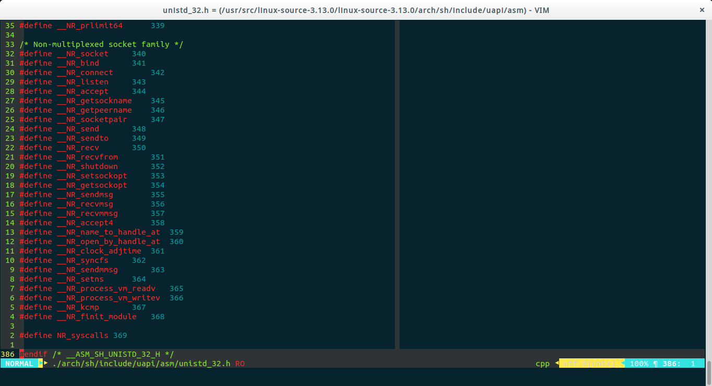

#### Linux系统调用

c语言为例，fopen/close/read/write 等函数均为 Glibc 为程序员提供的API。

每个特定的系统调用对应了至少一个 Glibc 封装的库函数，比如说，系统提供的打开文件系统调用 sys_open 对应的是 Glibc 中的 open 函数。

下图是系统调用对应图

同时操作系统是分层的，见下图

关键资源的代码放在 Ring0，称为内核态。R3是用户应用程序所在，称为用户态。

当一个用户态的程序运行到一半，要访问一个核心资源，例如访问网卡发一个网络包，就需要暂停当前的运行，调用系统调用，系统调用返回后再回到用户态。

> 综述，如果一个脚步执行过程中需要频繁的执行系统调用 则程序需要频繁的在用户态和内核态中切换，影响执行效率