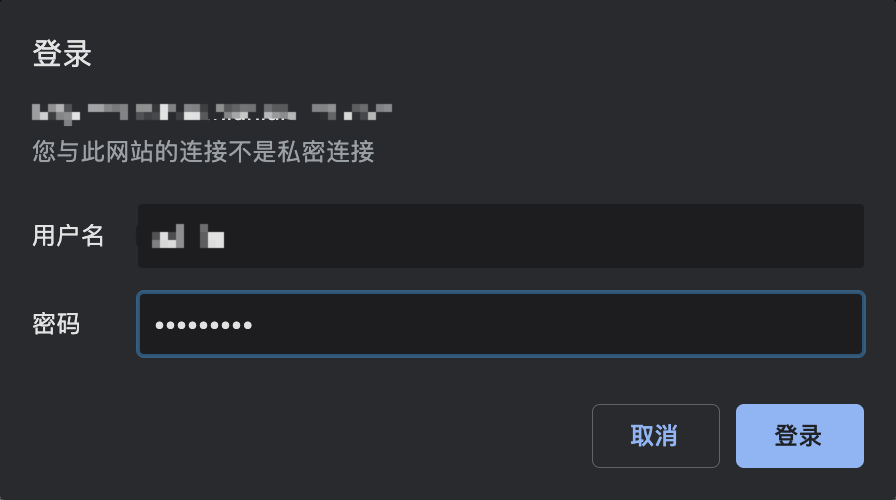

# 简介
traefik 是一个现代的http反向代理,对微服务支持良好,go语言编写,维护修改方便


## 优点
* 配置方式多样化,且支持热加载,配置不断更新
* 易于理解的代理模型
* 支持多种代理方式,及负载均衡算法
* 服务发现
* 支持grpc,websocket,http/2
* 易于配置的https
* 拥有REST API,webUI
* CPU利用率较高
* 活跃的社区,文档完善
## 缺点
* 不支持fastCGI(无法直接代理php)
* 速度较慢,1.5版本约为NGINX的85%

参考:
1. [官网](https://docs.traefik.io/)
2. [Traefik Benchmarks](https://docs.traefik.io/v1.5/benchmarks/)
3. [NGINX、HAProxy和Traefik负载均衡能力对比](https://zhuanlan.zhihu.com/p/41354937)

# 安装部署
推荐使用k8s环境部署,当然也有其他部署方式,可以[官网](https://docs.traefik.io/)查看
//todo 其他
## k8s环境部署

//todo 机器配置
>以下配置文件均在官网可以找到,部分配置略微和官网有些差别

* rbac  角色控制 (k8s v1.6 +) 
角色控制的作用,从下面的配置可以看出,我们授予了 traefik-ingress-controller 访问 services,endpoints,ingresses以及secrets资源的权限,
以及这三种资源的 get,list,watch 访问方式,并把该角色绑定到了kube-system 空间上,注意,该配置应该优先加载,否则后面的traefik实例有可能访问不到资源,造成不必要的麻烦
traefik-rbac.yaml
```yaml
---
kind: ClusterRole
apiVersion: rbac.authorization.k8s.io/v1beta1
metadata:
  name: traefik-ingress-controller
rules:
- apiGroups:
  - ""
  resources:
  - services
  - endpoints
  - secrets
  verbs:
  - get
  - list
  - watch
- apiGroups:
  - extensions
  resources:
  - ingresses
  verbs:
  - get
  - list
  - watch
---
kind: ClusterRoleBinding
apiVersion: rbac.authorization.k8s.io/v1beta1
metadata:
  name: traefik-ingress-controller
roleRef:
  apiGroup: rbac.authorization.k8s.io
  kind: ClusterRole
  name: traefik-ingress-controller
subjects:
- kind: ServiceAccount
  name: traefik-ingress-controller
  namespace: kube-system
```

```bash
kubectl apply -f traefik-rbac.yaml
```

### 有可能遇到的问题:
* 以前的服务直接pod都删掉了,traefik 日志里还一直报错,提示某个服务找不到
```bash
time="2019-05-20T01:19:22Z" level=error msg="Service not found for default/wechat-media-service"
time="2019-05-20T01:19:22Z" level=error msg="Service not found for default/auth-oauth-service-v1"
...
```
排查办法,从上面授与的访问资源排查,我们测试系统的一些服务,被运维删掉了,但是 ingresses 没有清除,所以会一直报错.
处理办法,清除对应 ingress 对象

* 无法监听到[后端](0.2.md)变化
查看rbac是否配置正确,查看锁监听后端是否处于正确的命名空间,查看ClusterRole是否正确建立
* 错误日志,资源无法访问
```bash
E0520 02:28:40.545103       1 reflector.go:205] github.com/containous/traefik/vendor/k8s.io/client-go/informers/factory.go:86: Failed to list *v1.Secret: Get https://10.96.0.1:443/api/v1/secrets?limit=500&resourceVersion=0: dial tcp 10.96.0.1:443: connect: connection refused
E0520 02:28:40.545658       1 reflector.go:205] github.com/containous/traefik/vendor/k8s.io/client-go/informers/factory.go:86: Failed to list *v1.Endpoints: Get https://10.96.0.1:443/api/v1/endpoints?limit=500&resourceVersion=0: dial tcp 10.96.0.1:443: connect: connection refused
E0520 02:28:41.544012       1 reflector.go:205] github.com/containous/traefik/vendor/k8s.io/client-go/informers/factory.go:86: Failed to list *v1beta1.Ingress: Get https://10.96.0.1:443/apis/extensions/v1beta1/ingresses?limit=500&resourceVersion=0: dial tcp 10.96.0.1:443: connect: connection refused
E0520 02:27:59.458753       1 streamwatcher.go:109] Unable to decode an event from the watch stream: http2: server sent GOAWAY and closed the connection; LastStreamID=23, ErrCode=NO_ERROR, debug=""
E0520 02:27:59.458966       1 streamwatcher.go:109] Unable to decode an event from the watch stream: http2: server sent GOAWAY and closed the connection; LastStreamID=23, ErrCode=NO_ERROR, debug=""
```
这类原因请检查你的dns是否正常,如果正常,请查看traefik的ingress里转发规则是否造成了闭环(同时会造成服务器链接超时,traefik表现为内存占用过高,需要仔细检查ingress配置)
* ds 
这里我们使用最新的traefik 镜像,开放了80(http),443(https)端口用于接收请求,8080(admin)是webui所用的端口,这里我们同时加载了一个自定义的配置文件,具体内容在下面
```yaml
---
apiVersion: v1
kind: ServiceAccount
metadata:
  name: traefik-ingress-controller
  namespace: kube-system
---
kind: DaemonSet
apiVersion: extensions/v1beta1
metadata:
  name: traefik-ingress-controller
  namespace: kube-system
  labels:
    k8s-app: traefik-ingress-lb
spec:
  template:
    metadata:
      labels:
        k8s-app: traefik-ingress-lb
        name: traefik-ingress-lb
    spec:
      serviceAccountName: traefik-ingress-controller
      terminationGracePeriodSeconds: 60
      containers:
      - image: traefik
        name: traefik-ingress-lb
        ports:
        - name: http
          containerPort: 80
          hostPort: 80
        - name: https
          containerPort: 443
          hostPort: 443
        - name: admin
          containerPort: 8080
        securityContext:
          capabilities:
            drop:
            - ALL
            add:
            - NET_BIND_SERVICE
        volumeMounts:
        - mountPath: /config
          name: config
        - mountPath: /cert
          name: cert
        args:
        - --api
        - --kubernetes
        - --logLevel=INFO
        - --configfile=/config/traefik.toml
      volumes:
      - name: config
        configMap:
          name: traefik-cfg
      - name: cert
        hostPath:
          path: /cert
          type: Directory
---
kind: Service
apiVersion: v1
metadata:
  name: traefik-ingress-service
  namespace: kube-system
spec:
  selector:
    k8s-app: traefik-ingress-lb
  ports:
  - protocol: TCP
    port: 80
    name: web
  - protocol: TCP
    port: 443
    name: https
  - protocol: TCP
    port: 8080
    targetPort: 8080
    name: admin
```
```bash
kubectl apply -f traefik-ds.yaml
```
### 可能遇到的问题
新建时pods pending,使用 kubectl describe 命令查看原因
```bash
kubectl describe pods/traefik-ingress-controller-6545547764-2c22w -n kube-system
```
kubectl describe 后面紧跟参数为资源类型/资源名 -n 指定对应命名空间
```bash
[root@k8s-master my-traefik]# kubectl describe pods/traefik-ingress-controller-6545547764-2c22w -n kube-system
前面省略...
Events:
  Type     Reason            Age                   From               Message
  ----     ------            ----                  ----               -------
  Warning  FailedScheduling  92s (x32 over 6m38s)  default-scheduler  0/1 nodes are available: 1 node(s) had taints that the pod didn't tolerate.
```
较为明显的原因,要分配的k8s节点不可用

* config 
这里是上面的配置内容,我们覆盖了一部分的默认配置,只用http
config
```yaml
kind: ConfigMap
apiVersion: v1
metadata:
  name: traefik-cfg
  namespace: kube-system
data:
  traefik.toml: |
    # 激活调试模式 （默认关闭）
    debug = false
    # 检查新版本 (默认开启)
    checkNewVersion=false
    # 日志等级 （默认 ERROR）
    logLevel = "INFO"
    # 全局入口点类型 （默认 http）
    defaultEntryPoints = ["http"]
    # 不上报统计信息
    sendAnonymousUsage = false
```
```bash
kubectl apply -f traefik-config.yaml
```
* web ui
为了ui的安全性考虑,我们可以做一些安全措施,如ip限制,auth认证之类的,这里我们简单介绍一种方法,basicAuth
使用下面的命令我们创建一个名为 adminsecret 的秘钥资源,在下面的ingress对象中使用
```bash
yum install httpd //安装httpd 
htpasswd -c ./auth admin //当前目录生成文件 auth,用户为admin,稍后会提示输入密码,按提示操作即可
kubectl create secret generic adminsecret --from-file auth --namespace=kube-system //从文件auth创建一个秘钥
```
traefik-ui.yaml
```yaml
---
apiVersion: extensions/v1beta1
kind: Ingress
metadata:
  name: traefik-web-ui
  namespace: kube-system
  annotations:
    kubernetes.io/ingress.class: traefik
    traefik.ingress.kubernetes.io/auth-type: "basic"
    traefik.ingress.kubernetes.io/auth-secret: "adminsecret"
spec:
  rules:
  - host: ui.example.com
    http:
      paths:
      - path: /
        backend:
          serviceName: traefik-ingress-service
          servicePort: admin
```
```bash
kubectl apply -f traefik-ui.yaml
```
访问上面的你自己定义的host(ui.example.com)可以看到,效果如下,让你输入账户密码

验证成功后即可进入下面的页面


